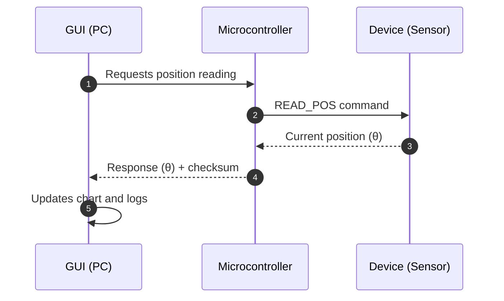
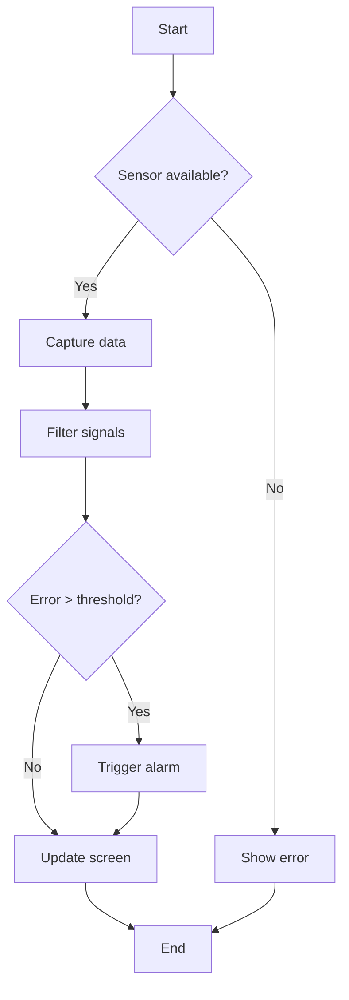
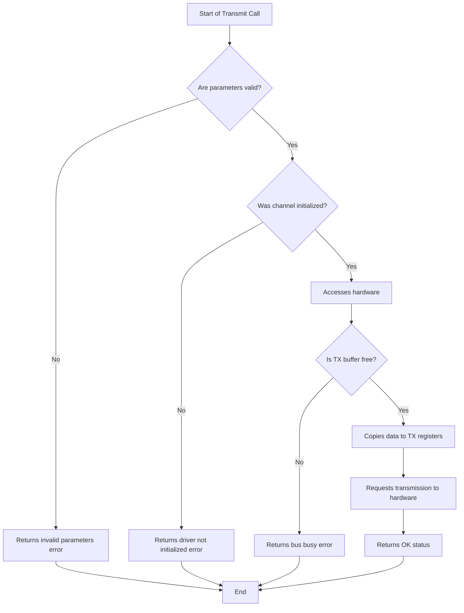
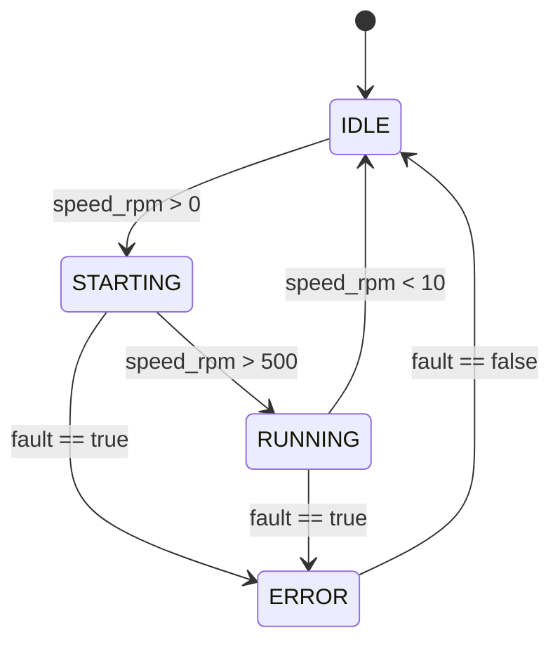
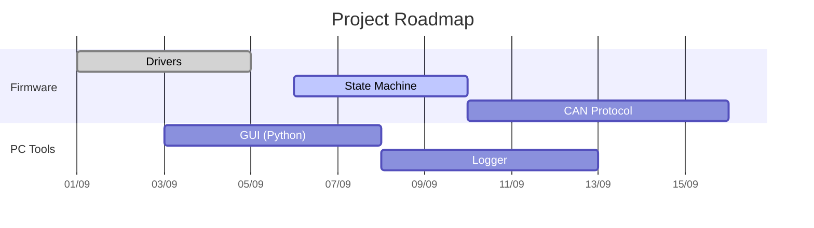

# Markdown VSCode - Complete Playground

This file is used to test VSCode **Preview** (and extensions such as Mermaid, Markdown All in One, etc.).
Enable preview with: `Ctrl+Shift+V` (or `⌘+Shift+V` on macOS).

---

## 1) Images

Simple image (if the extension/preview allows web access, it renders):


Clickable image:
[](https://code.visualstudio.com/)

---

## 2) Lists and Checkboxes

- Common item
  - Subitem
- Another item

Tasks:
- [x] Enable preview
- [x] Install Mermaid extension
- [x] Test diagrams

---

## 3) Tabelas

| Coluna A | Coluna B | Coluna C |
|:---------|:--------:|---------:|
| left | center   |   right |
| text    | **bold** | `code` |

---

## 4) Admonitions (Obsidian style / VSCode extensions)

> [!NOTE] Note
> This is an informational note.

> [!WARNING] Warning
> This is an important warning.

> [!TIP] Tip
> You can use extensions to enable these blocks.

> [!INFO] Info
> Depends on the renderer/extension.

---

## 5) Math (LaTeX/MathJax/Katex - depends on extension)

Inline: $E = mc^2$

Block:
$$
\int_0^\infty e^{-x^2}\,dx = \frac{\sqrt{\pi}}{2}
$$

---

## 6) Source Code (C)

```c
#include <stdint.h>
#include <stdbool.h>
#include <stdio.h>

// Example: simple state machine for a motor (partial)
typedef enum {
    STATE_IDLE = 0,
    STATE_STARTING,
    STATE_RUNNING,
    STATE_ERROR
} motor_state_t;

typedef struct {
    motor_state_t state;
    float current;   // mA
    float speed_rpm; // RPM
    bool fault;
} motor_ctx_t;

static void motor_handle(motor_ctx_t *ctx) {
    switch (ctx->state) {
        case STATE_IDLE:
            if (!ctx->fault && ctx->speed_rpm > 0.1f) {
                ctx->state = STATE_STARTING;
                printf("-> STARTING\\n");
            }
            break;

        case STATE_STARTING:
            if (ctx->fault) {
                ctx->state = STATE_ERROR;
                printf("-> ERROR\\n");
            } else if (ctx->speed_rpm > 500.0f) {
                ctx->state = STATE_RUNNING;
                printf("-> RUNNING\\n");
            }
            break;

        case STATE_RUNNING:
            if (ctx->fault || ctx->speed_rpm < 10.0f) {
                ctx->state = ctx->fault ? STATE_ERROR : STATE_IDLE;
                printf("-> %s\\n", ctx->fault ? "ERROR" : "IDLE");
            }
            break;

        case STATE_ERROR:
            // Simulated error reset
            if (!ctx->fault) {
                ctx->state = STATE_IDLE;
                printf("-> IDLE (recover)\\n");
            }
            break;
    }
}
```

---

## 7) Mermaid Diagrams (requires extension/renderer support)

### 7.1) Sequence Diagram



### 7.2) Flow Diagram (Flowchart)





### 7.3) State Transition Diagram (State Machine)



### 7.4) Gantt Diagram (Planning)



---

## 8) Collapsible Sections (HTML `<details>`)

<details>
  <summary>View execution log</summary>

  - Init OK
  - Sensor connected
  - Stable readings
  - No failures
</details>

---

## 9) Video (HTML iframe - may depend on preview policy)

[](https://www.youtube.com/watch?v=dQw4w9WgXcQ)

<iframe width="560" height="315" src="https://www.youtube.com/embed/dQw4w9WgXcQ"
title="YouTube video player" frameborder="0" allowfullscreen></iframe>

---

## 10) Footnotes (GitHub style)

This is an example with a footnote[^1] and another one[^ref].

[^1]: A simple footnote.
[^ref]: Another footnote, with more details.

---

## 11) Highlighted Code Blocks

### Python
```python
import time

def blink(n=3):
    for i in range(n):
        print(f"blink {i+1}")
        time.sleep(0.2)

blink()
```

### JSON
```json
{
  "device": "encoder",
  "part_number": "ABC-1234",
  "baudrate": 250000,
  "filters": [100, 50, 10],
  "enabled": true
}
```

---

## 12) Cross-references and Anchors

- See the **Sequence** diagram in [7.1](#71-sequence-diagram).
- See the **State Machine** in [7.3](#73-state-transition-diagram-state-machine).

---

## 13) Blockquotes

> Engineering is doing for R$ 10 what any fool can do for R$ 100.

---

## 14) Notes
- Some features **depend on VSCode extensions** (for example: Mermaid, Math).
- If something does not render, check whether the corresponding extension is installed and enabled.
- On GitHub, most Mermaid blocks work natively.
