<!-- If you're running this on a VSCode fork IDE, try to run the Markdown using Ctrl+Shift+V, Cmd+Shift+V or Ctrl+K then V -->

# UML diagrams using Mermaid

### Example of an Entity Relationship Diagram

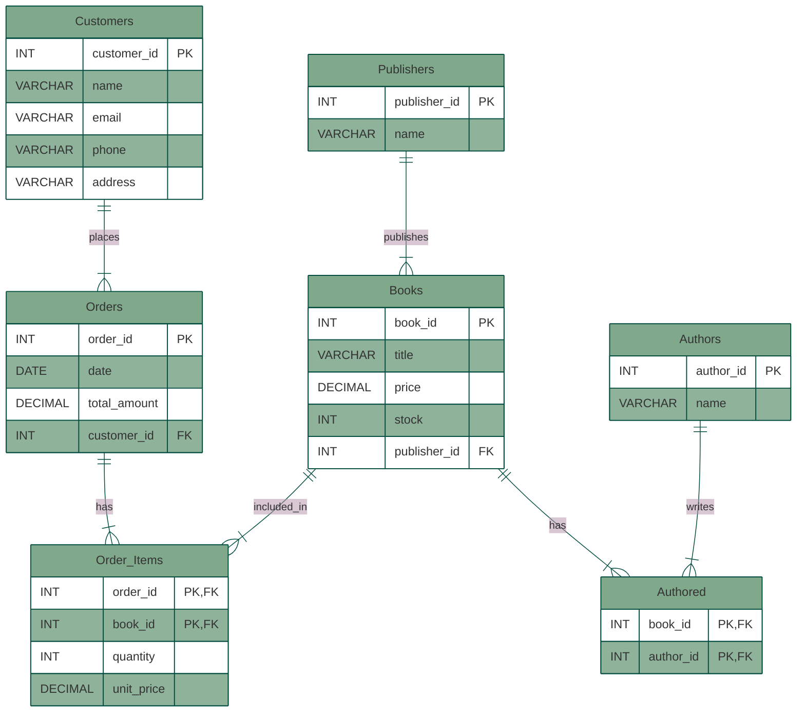

### Example of a Flowchart (as a Conceptual Data Model)

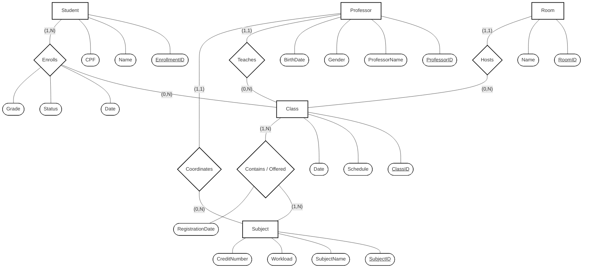
  
  
### Example of a Component Diagram

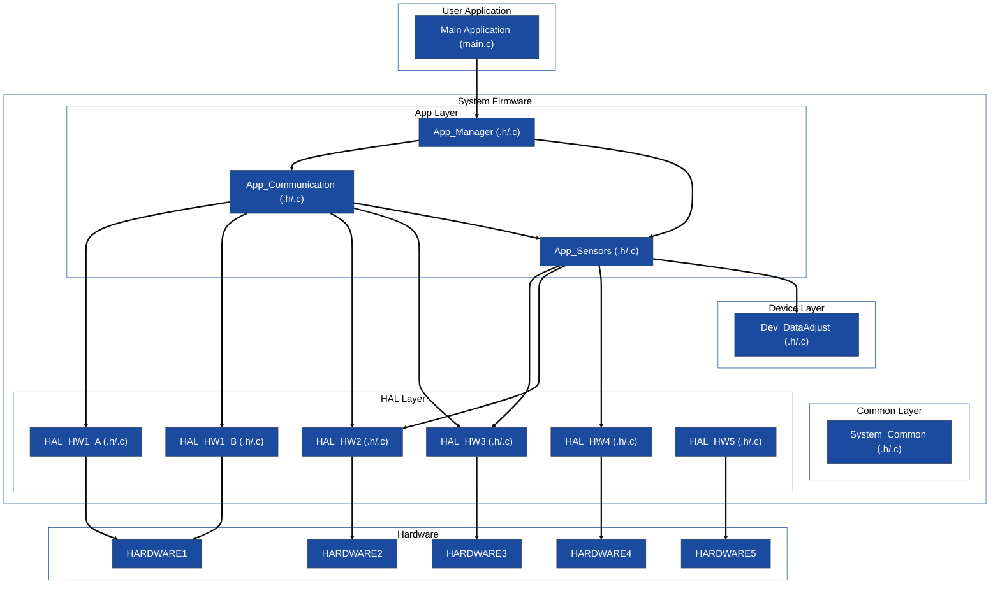
  
  
### Example of a Class Diagram

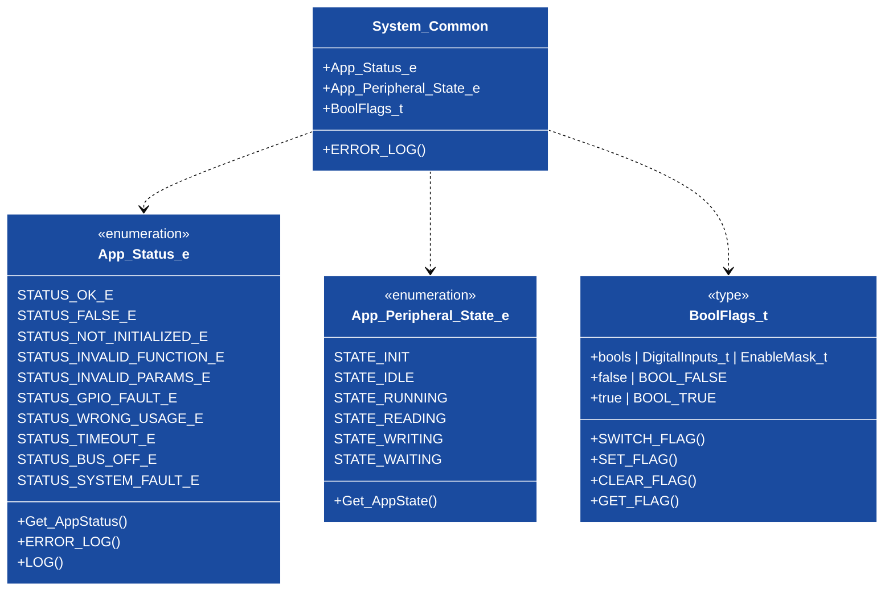
  
  
### Examples of a Sequence Diagram  

###### Example 1

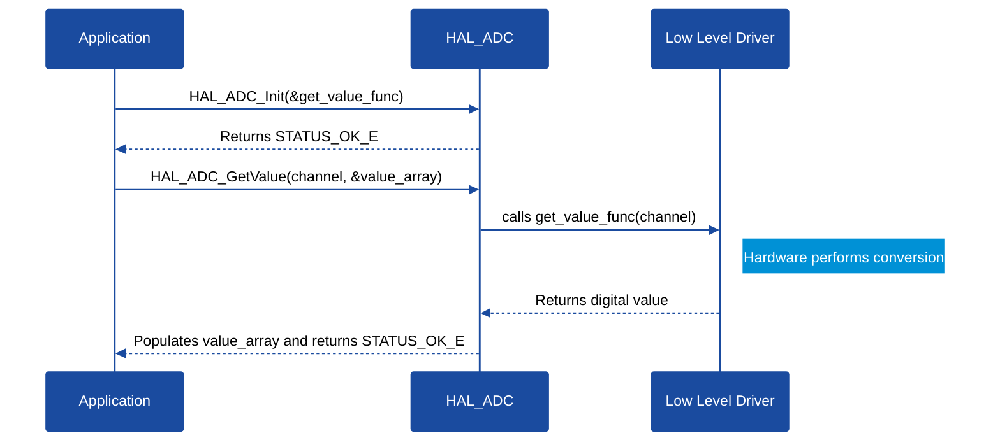
  

###### Example 2

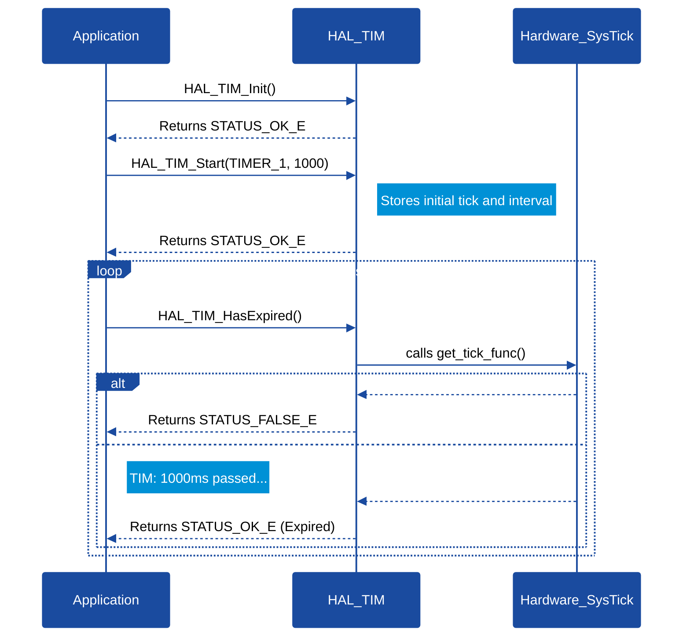
  

### Example of a Activities Diagram

###### Example 1

```mermaid

---
config:
  theme: 'base'
  themeVariables:
    fontSize: '12px' 
    textColor: '#FFFFFF'
    lineColor: '#000000'
    primaryColor: '#1A4B9F'
    primaryBorderColor: '#1A4B9F'
    secondaryColor: '#0091D6'
    tertiaryColor: '#FFFFFF'
    tertiaryBorderColor: '#000000'
---

graph TD
    subgraph "Sensing State Machine"
        A["IDLE<br>(Waiting to Start)"]
        B["ENABLING SENSORS<br>HAL_GPIO_WritePin(EN, HIGH)"]
        C["WAITING STABILIZATION<br>HAL_TIM_Start(timer, delay)"]
        D["READING SENSORS<br>HAL_GPIO_ReadPin(dig_in)<br>HAL_ADC_GetValue(adc_ch)"]
        E["PROCESSING DATA<br>(E.g., Calculate average, filter)"]
        F["DISABLING SENSORS<br>HAL_GPIO_WritePin(EN, LOW)"]
        G["DONE<br>(Results Ready)"]
        H["FAULT<br>(Operation Error)"]

        A --"[ Start Measurement ]"--> B
        B --"[ Success ]"--> C
        B --"[ Failure ]"--> H
        C --"[ HAL_TIM_HasExpired ]"--> D
        D --"[ Readings OK ]"--> E
        D --"[ Reading Failure ]"--> H
        E --"[ Processing OK ]"--> F
        F --"[ Disabled Successfully ]"--> G
        G --> A
        H --"[ New Cycle ]"--> A
    end

    style A fill:#00B39C,stroke:#00B39C
    style G fill:#00B39C,stroke:#00B39C
    style H fill:#EF5E31,stroke:#EF5E31
    
    class A,B,C,D,E,F,G,H whiteText
    linkStyle 0,1,2,3,4,5,6,7,8,9 color:white

    classDef whiteText color:white, stroke-width:2px

```
  
###### Example 2

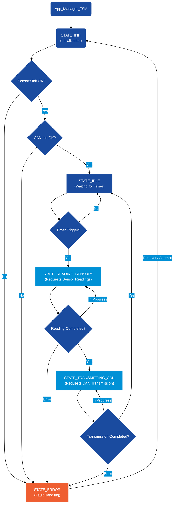

### Example of a Gantt Chart

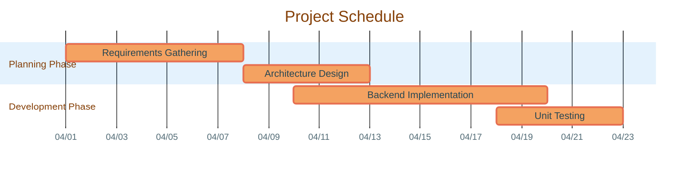

### Example of a Mindmap

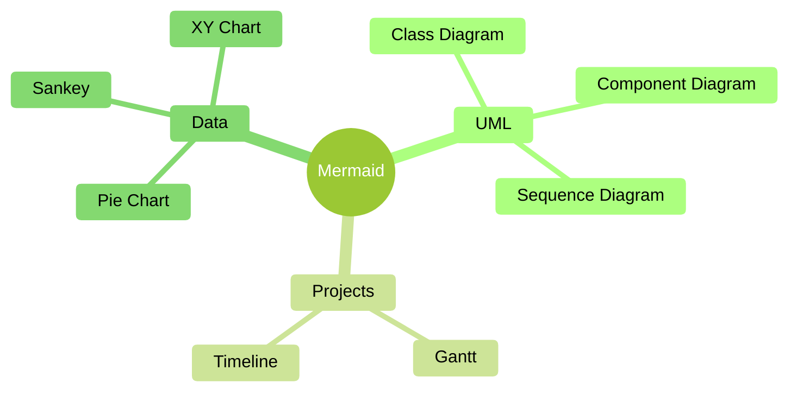

### Example of a Gitgraph

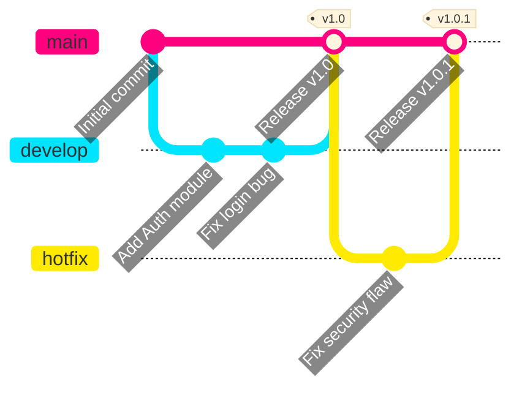

### Example of a State Diagram

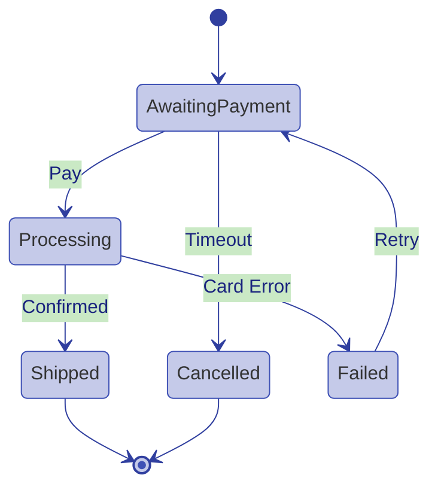

### Example of a Pie Chart

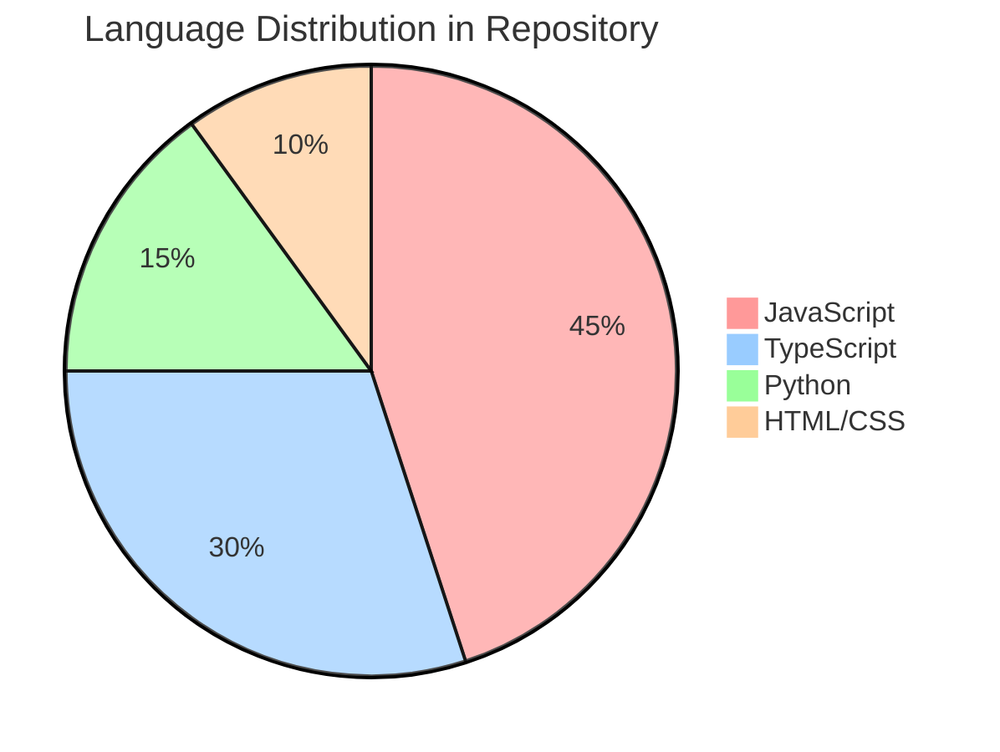

### Example of a Timeline

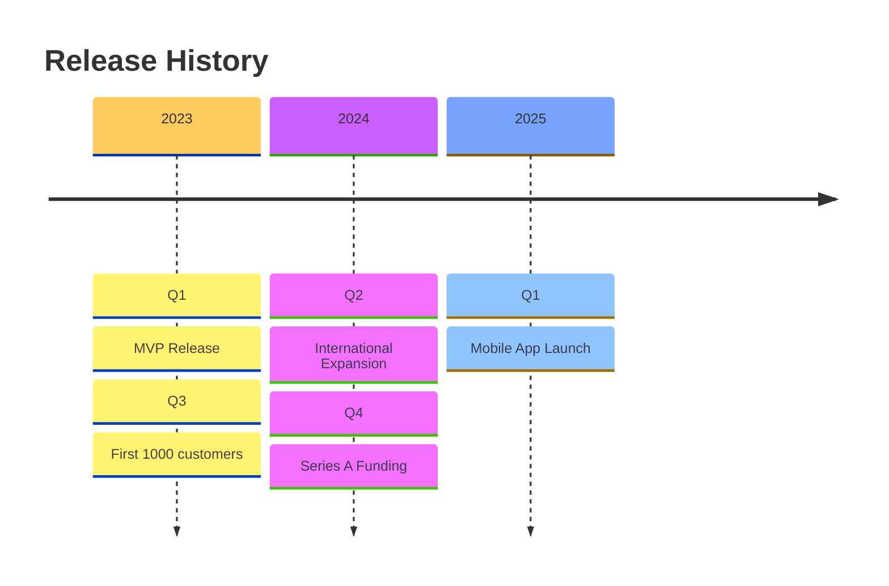

### Example of a Requirement Diagram

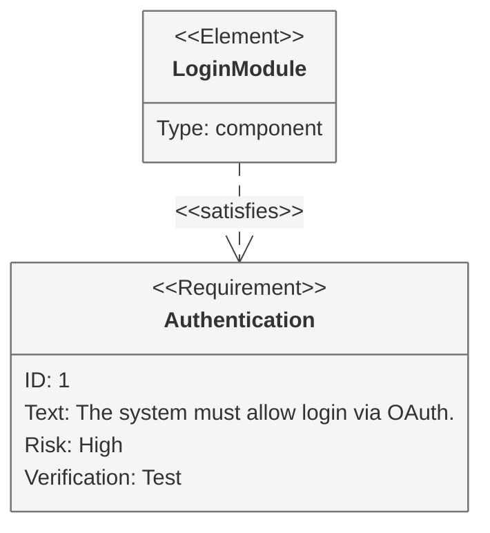
